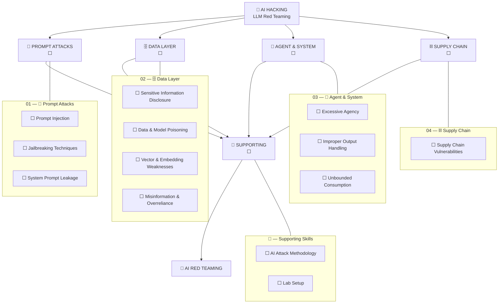

# 🤖 AI Hacking

> My structured path to attacking AI systems — LLM red teaming from prompt tricks to agent abuse.
>
> Four domains → individual techniques → technical notes → practical labs → AI red teaming.

> [⬅ My Hacking Hub](https://github.com/romeo-mhakayakora/CPTS) · [🌐 CPTS Notes Site](https://romeo-mhakayakora.github.io/CPTS/)

---

## 🗺️ AI Hacking Map

> Every node below is clickable — it takes you directly to its notes.



### Legend

| Status | Meaning |
|--------|---------|
| ✅ | Technique mastered + notes written |
| 🔄 | Currently practicing |
| ⬜ | Not started |
| 🔁 | Needs review / practical reinforcement |

---

## 📊 Overall Progress

| Domain | OWASP Coverage | Status | Entry Point |
|--------|:--------------:|:------:|-------------|
| 🎯 Prompt Attacks | LLM01, LLM07 | ⬜ | [Open →](./01-prompt-attacks/) |
| 🗄️ Data Layer | LLM02, LLM04, LLM08, LLM09 | ⬜ | [Open →](./02-data-layer/) |
| 🤖 Agent & System | LLM05, LLM06, LLM10 | ⬜ | [Open →](./03-agent-system/) |
| ⛓️ Supply Chain | LLM03 | ⬜ | [Open →](./04-supply-chain/) |
| 🧰 Supporting Skills | — | ⬜ | [Open →](./supporting/) |

---

---

## 01 — 🎯 Prompt Attacks

> Manipulating model behavior through crafted input. → [Domain README](./01-prompt-attacks/README.md)

| Module | OWASP | Status | Notes |
|--------|:-----:|:------:|:-----:|
| [Prompt Injection](./01-prompt-attacks/prompt-injection.md) | LLM01:2025 | ⬜ | [📖](./01-prompt-attacks/prompt-injection.md) |
| [Jailbreaking Techniques](./01-prompt-attacks/jailbreaking.md) | Technique | ⬜ | [📖](./01-prompt-attacks/jailbreaking.md) |
| [System Prompt Leakage](./01-prompt-attacks/system-prompt-leakage.md) | LLM07:2025 | ⬜ | [📖](./01-prompt-attacks/system-prompt-leakage.md) |

---

## 02 — 🗄️ Data Layer

> Training data, RAG stores, embeddings and outputs you should never see. → [Domain README](./02-data-layer/README.md)

| Module | OWASP | Status | Notes |
|--------|:-----:|:------:|:-----:|
| [Sensitive Information Disclosure](./02-data-layer/sensitive-information-disclosure.md) | LLM02:2025 | ⬜ | [📖](./02-data-layer/sensitive-information-disclosure.md) |
| [Data & Model Poisoning](./02-data-layer/data-model-poisoning.md) | LLM04:2025 | ⬜ | [📖](./02-data-layer/data-model-poisoning.md) |
| [Vector & Embedding Weaknesses (RAG Attacks)](./02-data-layer/vector-embedding-weaknesses.md) | LLM08:2025 | ⬜ | [📖](./02-data-layer/vector-embedding-weaknesses.md) |
| [Misinformation & Overreliance](./02-data-layer/misinformation.md) | LLM09:2025 | ⬜ | [📖](./02-data-layer/misinformation.md) |

---

## 03 — 🤖 Agent & System

> When the model can act: tools, plugins, outputs and resources. → [Domain README](./03-agent-system/README.md)

| Module | OWASP | Status | Notes |
|--------|:-----:|:------:|:-----:|
| [Excessive Agency (Tool & Function Abuse)](./03-agent-system/excessive-agency.md) | LLM06:2025 | ⬜ | [📖](./03-agent-system/excessive-agency.md) |
| [Improper Output Handling](./03-agent-system/improper-output-handling.md) | LLM05:2025 | ⬜ | [📖](./03-agent-system/improper-output-handling.md) |
| [Unbounded Consumption (DoS / Wallet Attacks)](./03-agent-system/unbounded-consumption.md) | LLM10:2025 | ⬜ | [📖](./03-agent-system/unbounded-consumption.md) |

---

## 04 — ⛓️ Supply Chain

> Models, plugins, datasets and components you didn't build. → [Domain README](./04-supply-chain/README.md)

| Module | OWASP | Status | Notes |
|--------|:-----:|:------:|:-----:|
| [Supply Chain Vulnerabilities](./04-supply-chain/supply-chain-vulnerabilities.md) | LLM03:2025 | ⬜ | [📖](./04-supply-chain/supply-chain-vulnerabilities.md) |

---

## 🧰 — Supporting Skills

> Methodology and lab setup supporting all AI attacks. → [Domain README](./supporting/README.md)

| Module | OWASP | Status | Notes |
|--------|:-----:|:------:|:-----:|
| [AI Attack Methodology](./supporting/attack-methodology.md) | — | ⬜ | [📖](./supporting/attack-methodology.md) |
| [Lab Setup (Local Models, Proxying, Tooling)](./supporting/lab-setup.md) | — | ⬜ | [📖](./supporting/lab-setup.md) |


## 🧭 Suggested Order

```text
Prompt Injection
      ↓
Jailbreaking
      ↓
System Prompt Leakage
      ↓
Sensitive Information Disclosure
      ↓
RAG / Vector Attacks
      ↓
Excessive Agency
      ↓
Supply Chain
```

## ✅ Readiness

A technique counts as mastered when I can explain it, execute it against an unfamiliar target, troubleshoot failures, document evidence, and chain it with other techniques.

---

[⬆ Back to top](#-ai-hacking)
